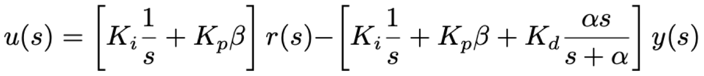
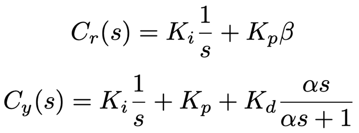
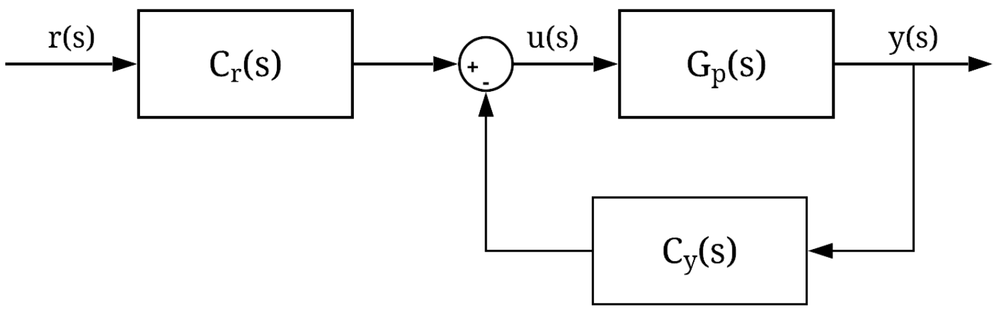

# 2-DOF PID Control of the Angular Position of an Industrial Plant Emulator

This repository contains the code for the paper "2-DOF PID Control of the Angular Position of an Industrial Plant Emulator", presented in the INTERCON 2020 conference.

## Description

In this project, we used a 2–DOF (2 Degrees of Free- dom) PID (Proportional Integral Derivative) controller to control the angular position of the rotational load of an industrial plant emulator. The plant consists of a DC servo motor that is connected to a speed reducer with backlash, which in turn is connected to a rotational load through an elastic belt. The performance of the 2–DOF PID control system is compared with the performance of a PID control system. Experimental results demonstrate that the former control system performs better in the presence of multiple disturbances such as backlash, friction and vibration by decreasing the magnitude of the oscillations in the steady state.

## Experimental setup

The plant possesses two high–resolution encoders of 16000 counts per revolution to measure the angular position (theta 1) of the servo motor, and the load disk theta 2. The DSP (Digital Signal Processor) based real-time controller then processes the data measured by the encoders and produces a control voltage, which is amplified and fed to the armature of the DC servo motor. The motor in turn generates the necessary torque to drive the angular position of the load disk.

The control algorithm is implemented in the ECP Executive Software, which allows the user to choose between a variety of control parameters, (PID, full–state feedback, pre–filters and feed–forward blocks), specifying command trajectories and selecting the data to be acquired.

## Algorithm

The 2-DOF PID controller is a variation of the classic PID controller that includes two set point weights. This modification has the potential to improve the transient and steady state responses of the plant. Mathematically, the 2-DOF PID controller is represented by 

This equation can be separated into two transfer functions, such that

The first transfer function (Cr) is applied to the reference signal, while the second one (Cy) is applied to the output signal in the feedback loop. The block diagram of the controller is shown below.

## Results

In this project, we implemented two real–time feedback control systems to control the angular position of a load disk connected to a servo motor through a speed reducer system with backlash, Coulomb friction and vibration. In general, both controllers achieved similar performance in experimental tests. However, in the presence of all disturbances, the step response of the 2–DOF PID controller showed significantly less overshoot and steady state error and similar settling time. The main reason for this difference is that the PID controller was not able to compensate the oscillations in the steady state produced by the presence of backlash and vibration. The amplitude of the oscillations in the PID control system tended to increase slowly with time, which implies that the overall system might become unstable.

